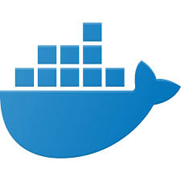

# cloud-devops

<p float="left">
  
   
  
  
</p>

## Project Summary  

Sentiment classification using DistllBERT.

---   

## Run Python scripts and web app

### Setup the Environment

* Create a virtualenv and activate it
* Run `make install` to install the necessary dependencies

### Running `app.py`

1. Standalone:  `python app.py`
2. Run in Docker:  `./run_docker.sh`
3. Run in Kubernetes:  `./run_kubernetes.sh`
4. Make a prediction: `./make_prediction.sh` TODO chage this
```Port: 8000
{
    "prediction": [
        20.35373177134412
    ]
}
```
5. Web app located at: `http://127.0.0.1:8000/`

### Kubernetes Steps

* Setup and Configure Docker locally
* Setup and Configure Kubernetes locally
* Create Flask app in Container
* Run via kubectl
